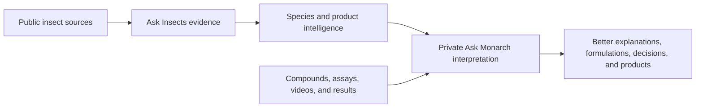

# Dual-Product Insect Intelligence

Date: 2026-07-13
Status: accepted for implementation

## Objective

Ask Insects should help Monarch understand insects deeply enough to create
effective repellents that protect people and crops without killing insects.
The first two product programs are:

1. A spotted wing drosophila crop repellent.
2. A human mosquito repellent, with `Aedes aegypti` as the first deep mosquito
   model.

The system must also make adding another insect routine. Diamondback moth,
`Plutella xylostella`, is the first proof of that expansion process.

## Product Boundary

Ask Insects owns public, source-backed knowledge about insects and repellent
product requirements. Ask Monarch owns private compounds, assays, videos,
results, decisions, and commercial work. Public insect evidence may flow into
Ask Monarch. Private Monarch evidence must not be copied into the public Ask
Insects source plane.

## Shared Insect Model

Every product insect is tracked against the same fourteen knowledge domains:

1. Sensory world
2. Brain and neurobiology
3. Receptors and signaling
4. Anatomy and physiology
5. Genetics and gene activity
6. Life cycle and development
7. Behavior
8. Reproduction and egg laying
9. Feeding and host finding
10. Movement, flight, and navigation
11. Learning, memory, and internal state
12. Ecology and interactions with other organisms
13. Chemical responses and metabolism
14. Adaptation and resistance

The labels are stable across species. Individual source lanes can be different,
but they must map their evidence to these shared domains.

## Product Readiness Model

Knowledge alone is not a product. Each product program also tracks:

1. Efficacy in the intended use
2. Mode of action
3. Formulation and delivery
4. Persistence and reapplication
5. Human or crop safety
6. Non-target and ecological effects
7. Field or human-use performance
8. Regulatory and commercialization evidence

These are planning and evidence-coverage dimensions. A readiness record must
not be presented as proof that a product works.

## Evidence Contract

Every domain and readiness record must say what is known and what is missing.
It must preserve these distinctions:

- `direct`: evidence names the focal species and relevant phenomenon.
- `inferred`: evidence comes from another species or context and is explicitly
  labeled as an inference.
- `unverified`: a candidate or machine extraction that has not passed the
  required scientific check.
- `human_verified`: a person has checked the decisive source and interpretation.
- `source_gap`: no adequate source is currently queryable.

Species and assay context must fail closed. A paper about another insect cannot
be promoted to focal-species evidence merely because it was returned by a
focal-species search. Disagreements, uncertainty, and missing knowledge remain
visible instead of being averaged away.

## Machine-Readable Program Ledger

`config/insect-intelligence-programs.json` is the durable definition of the
portfolio, product programs, species profiles, shared domains, readiness
dimensions, and evidence gates. The first profiles are:

- `Drosophila suzukii`: active crop-product target.
- `Aedes aegypti`: active human-product target and deep mosquito model.
- `Plutella xylostella`: next crop-pest target and expansion proof.

Adding a species requires a new ledger profile, aliases, product relationship,
domain statuses, source references, and explicit gaps. It must not require new
answer-routing code for that species.

## Queryable Records

The derived source `insect_intelligence_programs` writes records to the
`insect_intelligence` lane:

- one portfolio overview
- one product-program overview per product
- one species overview per species
- one domain record per species and shared knowledge domain
- one readiness record per product and readiness dimension
- explicit gap records for missing domain and readiness evidence

Record identifiers are stable and based on ledger identifiers. Every record
points back to an exact JSON locator in the ledger.

Natural questions such as these use the same generic answer path:

- "What does Ask Insects need to understand about diamondback moth?"
- "What is missing from SWD biology coverage?"
- "What is the product readiness status of the human mosquito repellent?"
- "Which insect is next after SWD and mosquitoes?"

The answer must identify the focal species or product, summarize statuses, list
the most important gaps, and return the underlying records as evidence.

## Compatibility

The existing Aedes source-coverage ledger and SWD source lanes remain intact in
the first increment. Their current questions and record identifiers must not
change. The new program layer describes the shared objective above those lanes
and provides the migration target for future species work.

## Ask Monarch Connection

The later private bridge will build a versioned context package from public Ask
Insects records and join it to private Ask Monarch experiments. It should help
Ask Monarch:

- explain why an observed behavior may have occurred
- distinguish contact, non-contact, feeding, landing, and egg-laying effects
- identify plausible mechanisms without presenting them as proven
- expose species, sex, life-stage, dose, duration, formulation, and environment
  mismatches
- suggest the missing evidence needed to distinguish explanations
- connect efficacy to persistence, safety, non-target, regulatory, and field
  constraints

The bridge will be evaluated on historical experiments whose outcomes are
hidden during interpretation. It succeeds only if the added insect knowledge
improves explanations or reveals important missing context more often than the
current Ask Monarch baseline.

## Reality Eval Gate

The authoritative completion gate asks exactly 50 natural questions through
normal Codex: 40 public development cases and 10 sealed holdouts. Every question
uses a fresh task in the real Codex app and follows this production route:

`Josh's question -> installed Ask Insects skill -> hosted production source plane -> complete visible Codex answer`

Only the first answer counts, and every complete answer must arrive in strictly
under 60 seconds. Independent review must pass accuracy, sources, relevance,
completeness, usefulness, privacy, and exact provenance. It must also preserve
the focal species, life stage, assay context, uncertainty, inference,
disagreement, and verified source gaps.

The threshold is 50 of 50 on one unchanged repository commit, installed skill,
and hosted revision. Any failure ends the run. A general repair is made, an
independent evaluator creates new holdouts, and the full counted run starts
again. The passing run must be recorded in full and shared with Josh. Unit
tests, direct SQL, local CLI calls, smoke subsets, and the legacy 210-case suite
are optional regression coverage, not completion evidence.

## Acceptance Criteria For The First Increment

- The machine-readable ledger validates all required domains, readiness
  dimensions, evidence gates, products, and species.
- SWD, Aedes, and diamondback moth use one generic record builder.
- Diamondback moth questions route without species-specific answer code.
- Missing diamondback moth evidence is returned as explicit gaps, not invented
  knowledge.
- Existing Aedes and SWD coverage tests remain green.
- Local and hosted ingestion expose the new records with exact provenance.
- The repository completion gate verifies the new contract.
- Reality Eval passes all 50 first answers through normal Codex under the
  60-second limit, with independent grading, complete provenance, 10 sealed
  holdouts, and a reviewed recording from the real Codex app.

## Non-Goals For The First Increment

- Completing all public source ingestion for diamondback moth.
- Claiming that any product is ready or that a compound is effective.
- Moving private Monarch evidence into Ask Insects.
- Automatically choosing compounds or experiments.
- Replacing scientific review.
